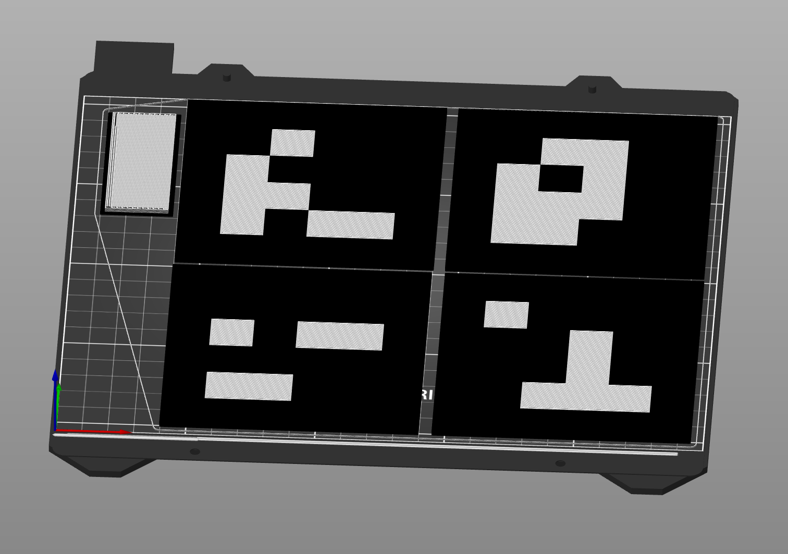

# Generate ArUco markers for 3D printing

This tool generates STL files for ArUco markers suitable for 3D printing – whether you have a printer with an MMU (multi-material unit) or not.

The script produces two modes:

- Stacked Mode (default):
  Generates a full-board base (`base.stl`) and a top layer (`top.stl`) with the marker pattern.
  This mode is suitable for printers WITHOUT an MMU (print the base in one color and then swap filament for the top layer).

- Flat Mode (`--flat` flag):
  Generates two interleaved parts at the same Z level (`black.stl` and `white.stl`),
  useful for printers WITH an MMU.



### Install

```bash
python3 -m venv env
source env/bin/activate
python3 -m pip install -r requirements.txt
pip install --upgrade pip
```

### Run
```bash
source env/bin/activate

# Generate marker with ID 101 into directory "aruco-101/"
# (Stacked mode: for printing WITHOUT MMU; outputs base.stl and top.stl)
python3 aruco-stl.py 101

# Generate marker with ID 102 into directory "aruco-102/"
# (Flat mode: for printing WITH MMU; outputs black.stl and white.stl)
python3 aruco-stl.py --flat 102

# Use --help for more options, e.g., to set thickness and overall size.
```

### Print
Drag the generated STL files into PrusaSlicer or your slicer of choice. In stacked mode, print the base (one color) first then the top (a different color). In flat mode, both parts lie on the same plane.

### Source code

...mostly generated by AI.

### Similar project

https://github.com/imontesino/3D-aruco-generator
