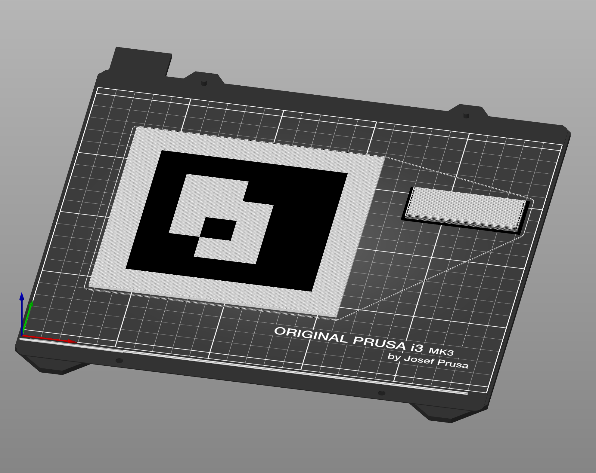

# Generate ArUco markers for 3D printing



### Install

```bash
python3 -m venv env
source env/bin/activate
python3 -m pip install -r requirements.txt
pip install --upgrade pip
```

### Run
```bash
source env/bin/activate

# generate marker with ID 101 into directory aruco-101/
python3 aruco-stl.py 101

# see --help for more options, i.e., thickness and size
```

### Print
Drag the images into PrusaSlicer.

### Source code

...mostly generated by AI.